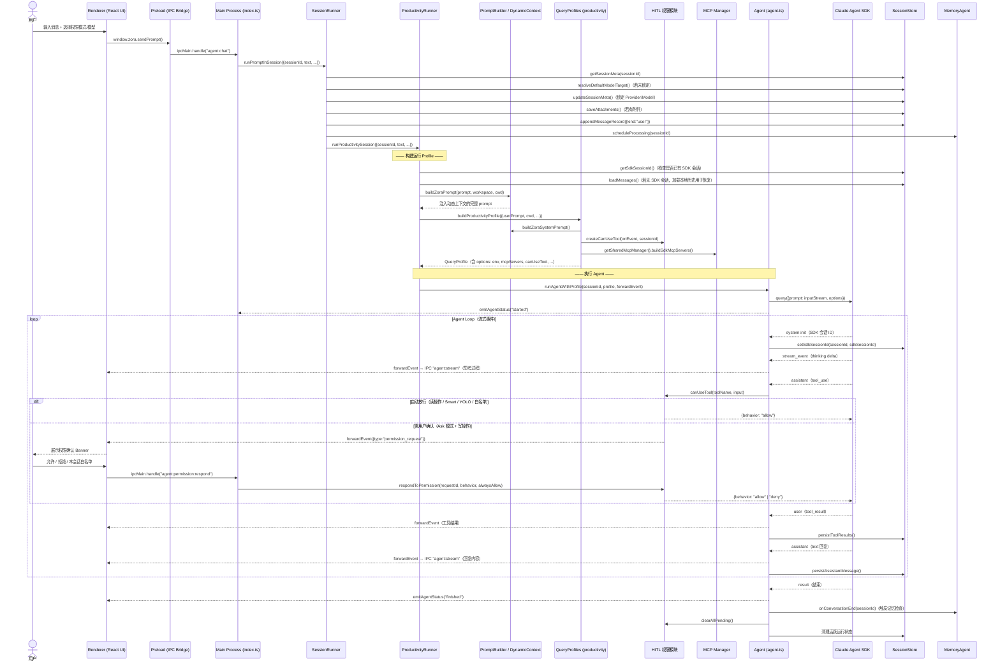
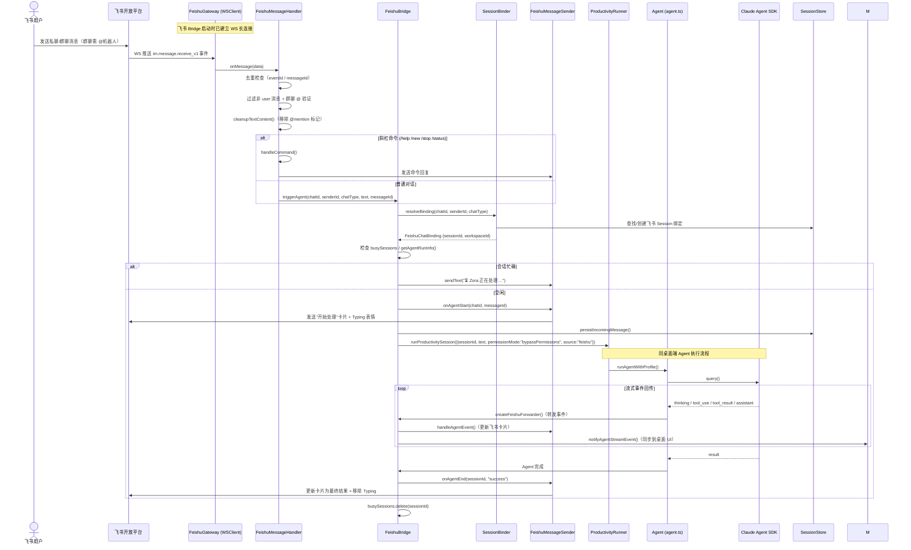
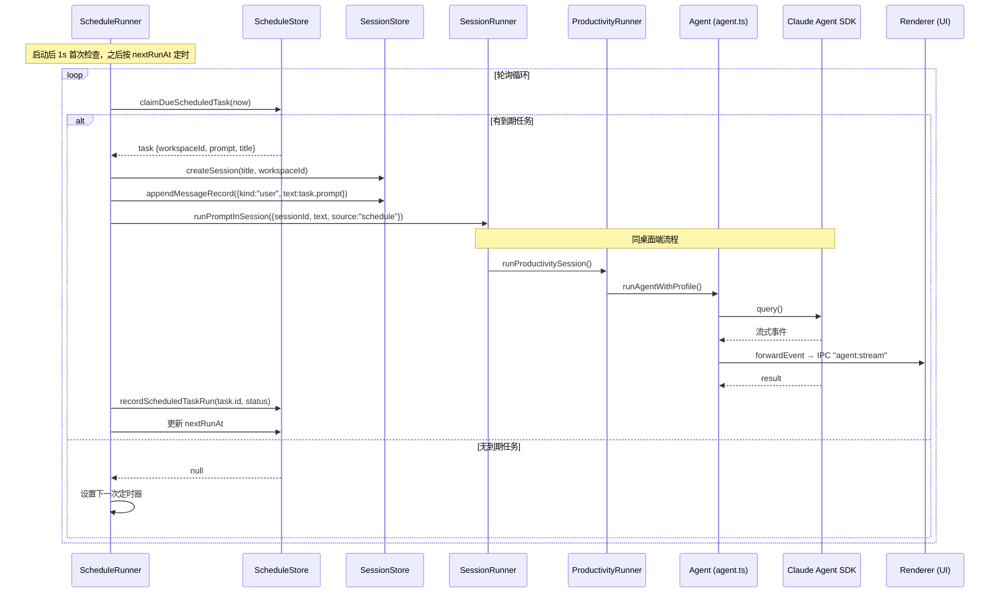
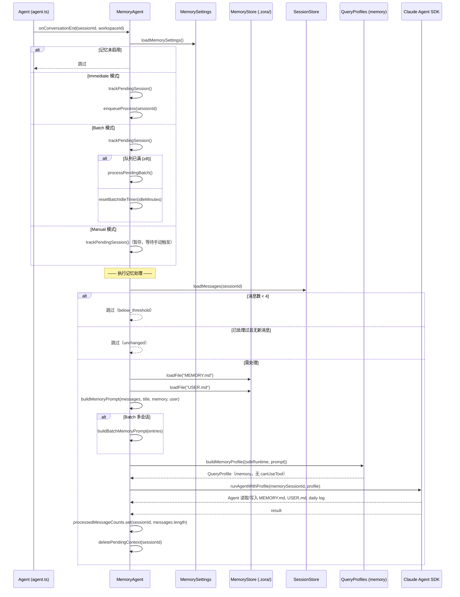
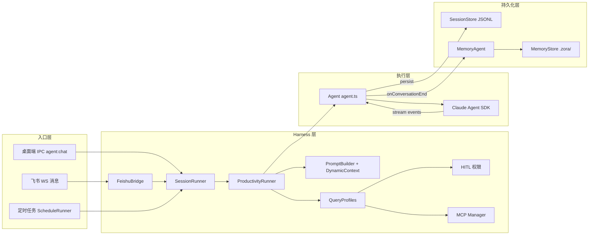

# Zora 时序图（历史存档）

> 状态：本文记录 Claude Runtime 单引擎时期的时序，当前不作为现役架构依据。现役 Runtime 路由、Pi checkpoint、跨 Runtime 历史和引导事件以 `README.md`、`src/main/runtime/` 和 `tests/e2e/` 为准。
>
> 本文保留飞书、定时任务和记忆处理的历史入口说明。桌面端当前通过 `AgentExecutionService → AgentRuntimeRouter → ClaudeAgentRuntimeAdapter / PiAgentRuntimeAdapter` 执行，产品历史由 Zora JSONL 持有。

---

## 1. 桌面端对话主链路

用户在 Electron 渲染进程输入消息，经 IPC 到达主进程，最终通过 Claude Agent SDK 执行并流式回传结果。

---

## 2. 飞书远程触发链路

飞书机器人通过 WebSocket 长连接接收消息，绑定到本地 Session 后执行 Agent，并将结果回发飞书。

---

## 3. 定时任务链路

ScheduleRunner 定时轮询到期任务，创建新 Session 并执行 Agent。

---

## 4. 会话结束后的记忆处理流程

Agent 执行完成后，MemoryAgent 根据记忆模式（Immediate / Batch / Manual）决定何时整理长期记忆。

---

## 5. 完整入口全景

三条入口链路汇聚到同一个 Agent 执行引擎。

