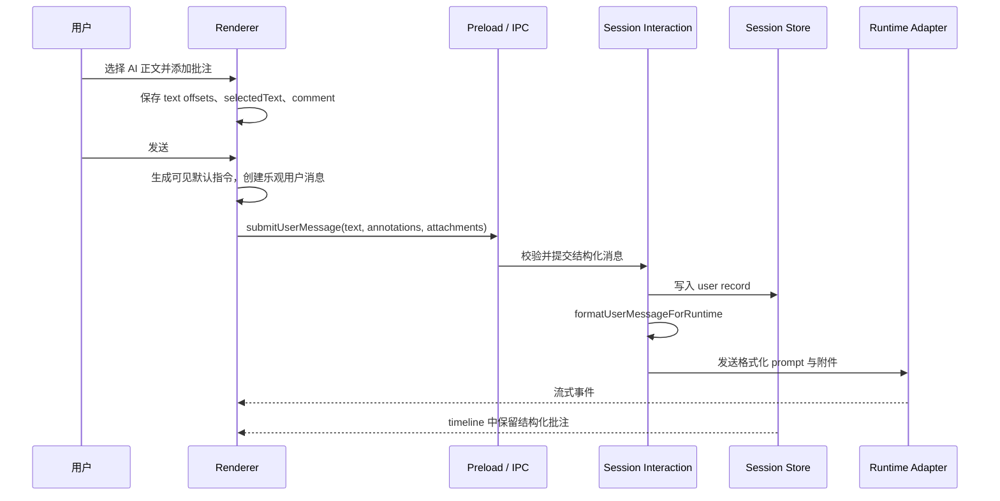

# AI 回复划词批注 Feature 方案

> 状态：v1，已实施并验证
>
> 日期：2026-08-26
>
> 适用范围：Zora 桌面端聊天界面
>
> Runtime 方向：以 Pi 为主路径，Claude 保持同一消息语义

## 方案结论

Zora 在已经生成完成的 AI 正文中支持划词批注。用户选中文字后，可以添加一条带可选评论的批注；多条批注集中挂在当前输入草稿中，随下一条用户消息一起发送。AI 获得用户的整体要求、所选原文和逐条评论，据此给出反馈。

本 Feature 采用一套统一的批注模型。单条空评论批注承担快速引用作用，多条批注承担集中审阅作用。产品不增加独立引用入口、富文本引用块和右侧评论栏。

产品合同如下：

- 所有已经生成完成的 AI 正文均可划词，包括标题、段落、列表、表格和代码块。
- 划词后先显示“添加批注”，点击后打开评论输入框。
- 评论选填。用户可以只保存所选原文，再在主输入框填写整体问题。
- 同一草稿可以累计多条批注，但所有批注必须来自同一条 AI 回复。
- 原文按阅读顺序编号，输入框显示“N 条批注”入口。
- 用户可以查看、定位、编辑和删除待发送批注。
- 主输入为空时允许发送，界面补入可见指令“请基于以下评论批注内容给出反馈。”
- 发送后清除原 AI 回复上的临时高亮和编号；用户消息保留批注摘要和完整内容。
- 切换会话后保留待发送批注；退出应用后清除，与现有文字草稿保持一致。
- 已发送批注写入 Session JSONL，并进入 Pi 与 Claude 的正式用户上下文。

### 方案取舍

| 方案 | 结论 | 判断 |
| --- | --- | --- |
| 独立引用功能 | 删除 | 单条空评论批注已经覆盖引用用途，继续保留会产生两套近似入口和消息结构 |
| 只在输入框显示批注附件 | 不采用 | 用户无法直接确认批注对应的原文位置 |
| 正文编号加输入框入口 | 采用 | 原文位置和集中管理同时保留，适合当前聊天布局 |
| 右侧评论栏 | 暂不采用 | 会增加侧栏布局、滚动同步和长期评论状态，本期没有多人审阅需求 |

最终界面由正文高亮编号和输入框批注入口组成。编号负责原文定位，输入框入口负责集中检查和发送。

## 用户问题

AI 输出较长时，用户通常在阅读过程中形成局部意见。当前产品要求用户复制原文、返回输入框、粘贴内容并补充说明。多个意见还需要用户手工整理顺序，AI 也很难稳定判断每条意见对应哪段原文。

划词批注要解决三个问题：

- 保留评论与原文的对应关系。
- 允许用户在阅读过程中连续积累意见。
- 让批注进入正式消息、会话记录和 Runtime 上下文。

## 范围

### 本期包含

- 已完成 AI 正文中的连续文本选择。
- 同一条 AI 回复内跨段、跨列表项、跨表格单元格或跨代码行选择。
- 单条和多条待发送批注。
- 可选的逐条评论。
- 原文高亮、编号、悬停摘要和点击编辑。
- 输入框中的批注入口、批注列表、定位、编辑和删除。
- 无主输入文字时的默认指令。
- 已发送用户消息中的批注摘要与展开内容。
- 批注的 IPC、Session JSONL、时间线和 Runtime 投影。
- 切换会话时的草稿保留。
- 来源位置不可用时的数据保留。

### 本期不包含

- 独立的“引用到输入框”入口。
- 富文本输入框或可编辑引用块。
- 右侧评论栏。
- 多人评论、回复评论、解决状态和评论指派。
- 跨多条 AI 回复的同一批批注。
- 思考过程、工具执行信息和用户消息批注。
- 流式正文批注。
- 应用重启后的待发送批注恢复。
- 已发送批注在原 AI 回复上的长期高亮。
- 手动拖动批注排序。

## 用户旅程

### 添加单条批注并提问

| 阶段 | 用户操作 | 界面反馈 | 数据结果 |
| --- | --- | --- | --- |
| 选择 | 在已完成的 AI 正文中划词 | 选择附近显示“添加批注” | 暂存一个 DOM Range，不写草稿 |
| 添加 | 点击“添加批注” | 原位置打开评论输入框 | 保留已选择范围 |
| 保存 | 评论留空，按 Enter | 原文高亮并显示编号 1；输入框显示“1 条批注” | 创建一条待发送批注 |
| 提问 | 在主输入框填写问题 | 批注入口继续显示 | 普通文字与批注属于同一草稿 |
| 发送 | 点击发送 | 原文高亮清除；出现用户消息 | 批注写入会话并进入 Runtime |

### 连续审阅一条长回复

| 阶段 | 用户操作 | 界面反馈 | 数据结果 |
| --- | --- | --- | --- |
| 积累 | 从后往前选择三处内容并填写评论 | 正文出现三个高亮编号 | 批注按原文位置重新排序为 1、2、3 |
| 检查 | 悬停输入框中的“3 条批注” | 显示只读摘要 | 草稿不变化 |
| 管理 | 点击入口，在列表中编辑第二条、删除第三条 | 编号和列表同步更新 | 草稿剩余两条并重新编号 |
| 定位 | 点击定位图标 | 页面滚动到原文并短暂突出显示 | 批注数据不变化 |
| 发送 | 主输入留空，点击发送 | 用户消息显示默认指令和“2 条批注” | 默认指令与两条批注进入 Runtime |

### 切换会话后继续审阅

| 阶段 | 用户操作 | 界面反馈 | 数据结果 |
| --- | --- | --- | --- |
| 离开 | 当前会话已有待发送批注，切换到其他会话 | 其他会话显示自己的草稿 | 原会话批注保留在 Renderer 内存 |
| 返回 | 再次打开原会话 | 恢复批注入口和可解析的原文高亮 | 按 Session ID 读取草稿批注 |
| 退出 | 完全关闭应用 | 无额外确认 | 待发送批注随 Renderer 状态清除 |

### 来源位置不可用

来源消息被会话重写、重新生成或删除后，批注仍保留所选原文和评论。批注列表显示“原文位置不可用”，定位图标禁用；编辑、删除和发送继续可用。

## 交互合同

### 选择范围

选择必须满足以下条件：

- 起点和终点都位于同一条已完成 AI 回复的正文容器内。
- 选择结果包含至少一个非空白字符。
- 选择不经过思考过程、工具执行区、操作按钮或其他消息。
- 一次选择是一个连续 Range，可以跨越正文中的多个文本节点和块级元素。

不符合条件时不显示“添加批注”。用户继续选择、点击正文外区域、按 Esc 或开始新的选择时，当前操作入口关闭。

### 创建批注

划词后显示一个紧邻选择范围的小型操作入口：

```text
┌────────────────┐
│ 批注图标 添加批注 │
└────────────────┘
```

点击后，入口切换为评论编辑器：

```text
┌───────────────────────────────┐
│ 添加评论，可选……              │
│                     取消  添加 │
└───────────────────────────────┘
```

编辑器规则：

- Enter 添加批注。
- Shift + Enter 换行。
- Esc 取消。
- 输入法处于组合输入状态时，Enter 不提交。
- 输入框随内容增高，达到上限后内部滚动。
- 空评论允许提交，保存时归一化为 `undefined`。

完全相同的来源消息、起始偏移和结束偏移再次添加时，直接打开已有批注。部分重叠的范围可以生成独立批注。

### 原文高亮与编号

待发送批注使用低干扰背景色标出原文，并在选择末尾显示编号按钮。编号按照 `startOffset`、`endOffset`、`id` 排序后计算，不写入持久化数据。

- 悬停编号显示所选原文和评论摘要。
- 聚焦编号获得相同摘要，键盘用户可以访问。
- 点击编号打开批注编辑器。
- 部分重叠的批注同时高亮，各自保留编号。
- 发送或清空草稿后立即移除高亮和编号。

高亮不修改 Streamdown 生成的 DOM。正文使用 CSS Custom Highlight API 注册 Range；编号按钮通过覆盖层锚定在 Range 最后一个可见矩形附近。

### 输入框批注入口

附件预览下方、主文本输入框上方显示批注入口：

```text
[批注图标  3 条批注]
```

- 悬停或键盘聚焦时显示只读摘要。
- 点击后打开完整列表。
- 列表按原文阅读顺序排列。
- 每条显示所选原文、可选评论和三个操作图标。
- 悬停摘要截断为少量文本；完整列表展示全部所选原文和评论。
- 定位使用定位图标，编辑使用铅笔图标，删除使用垃圾桶图标。
- 图标提供 `aria-label`、`title` 和焦点样式。
- 删除图标悬停和聚焦时使用危险操作颜色。
- 点击定位后滚动到来源消息，并短暂加强对应高亮。

入口和列表属于输入草稿。文件附件继续使用现有附件预览，两类内容不合并成同一个附件模型。

### 发送状态

发送条件调整为以下内容任一存在：

- 主输入文字。
- 文件附件。
- 待发送批注。

主输入为空且存在批注时，发送前补入可见默认指令：

> 请基于以下评论批注内容给出反馈。

默认指令写入用户消息，用户可以在会话记录中看到。它不限制评论只作用于所选范围。AI 根据用户评论和上下文判断反馈范围。

发送开始后，Renderer 以同一个快照创建乐观用户消息并清空当前草稿。快照包含最终可见文字、附件和批注，防止异步提交期间草稿变化污染本次发送。

### 已发送用户消息

用户消息显示整体文字和批注摘要：

```text
请基于以下评论批注内容给出反馈。

[批注图标  3 条批注  展开]
```

展开后显示完整的所选原文和评论。已发送状态只读，不提供批注编辑和删除；历史消息的“修改并重新运行”只编辑整体文字，原批注随消息保留并再次进入 Runtime。

## 领域模型

共享类型放在 `src/shared/zora.d.ts`，Renderer、Preload 和 Main 使用同一合同：

```typescript
export interface ResponseAnnotationAnchor {
  /** 相对 AI 正文可批注文本面的 UTF-16 偏移。 */
  startOffset: number;
  endOffset: number;
  /** 精确保留用户选择的可见文本，用于显示、Runtime 和锚点校验。 */
  selectedText: string;
}

export interface ResponseAnnotation {
  id: string;
  sourceMessageId: string;
  anchor: ResponseAnnotationAnchor;
  comment?: string;
}

export interface SubmitUserMessageInput {
  sessionId: string;
  workspaceId?: string;
  messageId: string;
  text: string;
  attachments?: FileAttachment[];
  responseAnnotations?: ResponseAnnotation[];
}

export interface ConversationMessage {
  id: string;
  role: "user" | "assistant";
  text?: string;
  attachments?: FileAttachment[];
  responseAnnotations?: ResponseAnnotation[];
  // 其他现有字段保持不变
}
```

`sourceMessageId` 指向 `ConversationMessage.id`。当前 Assistant 消息 ID 与 `turn.id` 相同，不再重复保存 `sourceTurnId` 或 `segmentId`。整个正文使用统一偏移，选择可以跨越多个 `BodySegment`。

### 数据不变量

每次写入草稿、IPC 和 Session Store 时都校验：

- `id` 和 `sourceMessageId` 是非空字符串。
- `startOffset` 是大于等于 0 的整数。
- `endOffset` 是大于 `startOffset` 的整数。
- `selectedText` 至少包含一个非空白字符。
- `comment` 去除首尾空白后为空时写为 `undefined`。
- 同一数组中的 `id` 唯一。
- 同一数组中的 `sourceMessageId` 相同。
- 相同 `sourceMessageId + startOffset + endOffset` 只保留一条，并进入编辑流程。

Main 只校验数据形状和批次不变量，不要求来源消息仍然存在。来源位置不可用是允许发送的产品状态。

## 文本锚点

### 可批注文本面

`AssistantBodySection` 为每条已完成回复提供一个 `data-response-annotation-surface` 容器。偏移只计算这个容器内的正文文本节点。

文本遍历跳过以下节点：

- `button`、`input`、`textarea`。
- `svg`、`script`、`style`。
- `[contenteditable]`。
- `[aria-hidden="true"]`。
- `[data-response-annotation-exclude]`。

正文文本按照 DOM TreeWalker 的文本节点顺序连接。偏移采用 JavaScript 字符串和 DOM Range 共同使用的 UTF-16 code unit，避免额外的 Unicode 索引转换。

### 捕获

Renderer 从 `window.getSelection()` 克隆有效 Range，并计算：

```typescript
interface CapturedResponseSelection {
  sourceMessageId: string;
  startOffset: number;
  endOffset: number;
  selectedText: string;
  range: Range;
  placementRect: DOMRect;
}
```

`range` 和 `placementRect` 只服务当前交互，不写入 Atom、IPC 或持久化数据。

### 恢复与校验

会话切换回来或消息重新渲染时，Renderer 根据 `startOffset` 和 `endOffset` 重建 Range，再比较 `range.toString()` 与 `selectedText`：

- 一致：恢复高亮、编号和定位能力。
- 不一致：保留批注数据，标记来源位置不可用。

来源不可用后不做模糊文本搜索。相同文字可能在回复中出现多次，模糊匹配会把评论定位到错误位置。用户已经确认的所选原文仍用于消息展示和 Runtime 上下文。

## 草稿状态

`src/renderer/store/chat.ts` 增加按 Session 隔离的批注草稿：

```typescript
type SessionDraftAnnotations = Record<string, ResponseAnnotation[]>;

const sessionDraftAnnotationsAtom = atom<SessionDraftAnnotations>({});

export const draftResponseAnnotationsAtom = atom(
  (get) => {
    const sessionId = get(currentSessionIdAtom);
    return sessionId ? get(sessionDraftAnnotationsAtom)[sessionId] ?? [] : [];
  },
  // 使用显式 action 更新，避免组件直接改数组
);
```

需要提供以下写操作：

- `addDraftResponseAnnotationAtom`
- `updateDraftResponseAnnotationAtom`
- `removeDraftResponseAnnotationAtom`
- `clearDraftResponseAnnotationsAtom`
- `replaceDraftResponseAnnotationsAtom`

删除 Session 时同步清理文字草稿、附件草稿和批注草稿。切换 Session 只改变当前投影，不删除任何草稿。应用退出后 Atom 自然释放，不增加磁盘草稿文件。

## 消息投影

结构化批注有两种投影：

- 产品投影：用户消息中的可折叠批注列表。
- Runtime 投影：模型能够稳定理解的文本块。

两种投影共享同一份 `ResponseAnnotation[]`，不在 Renderer 预先拼接 Runtime 文本。

`src/shared/response-annotations.ts` 作为唯一规则模块，负责：

- 规范化与校验。
- 阅读顺序排序。
- 默认可见指令。
- Runtime 文本格式化。

Runtime 格式如下：

```text
请基于以下评论批注内容给出反馈。

<response_annotations>
  <annotation index="1">
    <selected_text>需要额外授权 scope</selected_text>
    <comment>补充具体权限名称</comment>
  </annotation>
  <annotation index="2">
    <selected_text>后续搜索命中自然补齐</selected_text>
  </annotation>
</response_annotations>
```

格式化规则：

- 用户填写了整体文字时，原样作为首段；主输入为空时使用默认指令。
- `selected_text` 是引用上下文，`comment` 是用户反馈。
- XML 特殊字符统一转义。
- 空评论不输出 `<comment>`。
- `sourceMessageId` 和偏移只服务产品定位，不写入模型文本。
- 批注顺序使用规范化后的阅读顺序。
- 文件附件继续沿现有附件链路发送。

`formatUserMessageForRuntime` 必须用于当前消息、Pi 历史投影、Pi checkpoint 对齐和历史消息重新运行，防止同一用户消息在不同 Runtime 路径中得到不同内容。

## 发送链路



### Renderer

`MainArea.handleSend` 获取文字、附件和批注的不可变快照。若文字为空且存在批注，使用共享模块生成默认可见指令。乐观用户消息、IPC 参数和失败后的本地消息使用同一快照。

发送成功进入现有 started 或 enqueued 路径；运行中的追加消息同样携带批注。清空操作覆盖文字、附件和批注。

### IPC

`agent:submit-user-message` 接收 `responseAnnotations`，调用共享规范化函数。IPC 不读取 Renderer DOM，也不重新计算锚点。

### Session Interaction

空闲路径把结构化消息交给 `runPromptInSession`。运行中路径先持久化产品消息，再把格式化 Runtime 文本交给 `agentExecutionService.enqueue`。运行状态变化后的重试路径复用同一个持久化结果和 Runtime 文本。

### Session Runner

`runPromptInSession` 同时接收可见 `text`、`responseAnnotations` 和附件：

1. 保存用户消息原始结构。
2. 调用 `formatUserMessageForRuntime` 生成当前 prompt。
3. 把格式化 prompt 交给 Runtime Router。

产品历史保存结构化数据，Runtime checkpoint 继续作为派生数据。

## Runtime 合同

### Pi

Pi 是本 Feature 的主路径。以下位置统一使用格式化后的用户消息：

- 当前 run 的 prompt。
- `buildPiConversationHistory` 中的历史用户消息。
- 当前消息与历史末尾消息的去重比较。
- `pi-session-bridge` 查找当前用户消息和 checkpoint cursor 对齐。
- 运行中 enqueue。
- 历史修改后的重新运行。

Pi 历史投影仍从 Zora Session 读取完整会话。批注不会形成独立 Pi message，也不会改变 assistant 历史投影。

### Claude

Claude Runtime 接收与 Pi 相同的格式化当前 prompt 和 enqueue 文本。Claude SDK checkpoint 继续保存 Runtime 派生历史；Zora Session JSONL 保存产品侧结构化批注。切换 Runtime 时，产品消息语义以 `formatUserMessageForRuntime` 为准。

### 记忆处理

现有 Memory Agent 从产品消息读取用户文本。实现时需要明确改为读取 Runtime 格式化文本或等价的结构化批注投影，保证用户评论可以进入记忆处理。Memory Agent 不保存 DOM 偏移和来源定位数据。

## 持久化合同

用户记录继续使用现有 `kind: "user"`：

```json
{
  "kind": "user",
  "message": {
    "id": "user-uuid",
    "role": "user",
    "text": "请基于以下评论批注内容给出反馈。",
    "responseAnnotations": [
      {
        "id": "annotation-uuid",
        "sourceMessageId": "assistant-turn-uuid",
        "anchor": {
          "startOffset": 120,
          "endOffset": 138,
          "selectedText": "需要额外授权 scope"
        },
        "comment": "补充具体权限名称"
      }
    ],
    "timestamp": 1787673600000
  }
}
```

`loadMessages` 规范化 `responseAnnotations` 并恢复到 `ConversationMessage`。字段缺失表示普通用户消息，不增加 schema 版本、迁移脚本或兼容分支。

Session timeline snapshot、`user_message_committed` 事件和 Renderer optimistic message 都携带相同字段。禁止在时间线投影时丢弃或重新格式化批注。

## 历史修改与运行中修正

已发送批注只读。用户点击历史消息的“修改并重新运行”时：

- 编辑器只修改 `message.text`。
- 原 `responseAnnotations` 保持不变。
- `reviseUserMessageRecord` 更新文字并保留批注。
- 重新运行使用修改后的文字和原批注重新生成 Runtime prompt。
- 用户把文字删空但消息仍有批注时，恢复默认可见指令并允许重新运行。

`UserMessage` 的可提交判断、`SubmitUserEditInput` 的主进程校验和 `revisePromptInSession` 的空消息校验都要把 `responseAnnotations` 计入有效内容，不能继续只检查文字和附件。

运行中的“修正消息”继续生成 correction。原 annotated message 已经进入当前 Runtime，correction 只表达用户对整体文字的修正，不重复发送原批注。

## UI 模块

建议增加以下模块，保持选择、展示和消息传输的关注点分离：

| 模块 | 职责 |
| --- | --- |
| `src/shared/response-annotations.ts` | 类型规范化、排序、默认指令、Runtime 格式化 |
| `src/renderer/utils/responseAnnotationRange.ts` | DOM Range 捕获、偏移计算、Range 恢复和精确校验 |
| `ResponseAnnotationComposer.tsx` | 输入框批注入口、摘要和管理列表 |
| `ResponseAnnotationEditor.tsx` | 划词旁评论编辑器 |
| `ResponseAnnotationHighlights.tsx` | CSS Highlight 注册、编号覆盖层和定位强调 |
| `ResponseAnnotationList.tsx` | 草稿和已发送消息共用的批注内容展示 |

现有文件的主要调整：

| 文件 | 调整 |
| --- | --- |
| `AssistantMessage.tsx` | 提供消息 ID、完成状态和正文 surface；接入选择与高亮模块 |
| `MarkdownMessage.tsx` | 标记需要排除的内部操作节点，正文渲染语义保持不变 |
| `ChatInput.tsx` | 显示批注入口，把批注纳入可发送条件 |
| `MainArea.tsx` | 快照化文字、附件和批注；发送后统一清理 |
| `UserMessage.tsx` | 展示只读批注摘要与展开内容；编辑时保留批注 |
| `store/chat.ts` | 增加 Session 级批注草稿和 optimistic message 字段 |
| `src/shared/zora.d.ts` | 增加共享类型和消息字段 |
| `src/preload/index.ts` | 透传扩展后的提交合同 |
| `src/main/index.ts` | IPC 规范化批注 |
| `session-interaction.ts` | 持久化并格式化 started、enqueued 和重试路径 |
| `session-runner.ts` | 保存结构化消息，向 Runtime 发送格式化 prompt |
| `session-store.ts` | 写入、读取、修改时保留批注 |
| `runtime/pi-conversation.ts` | 历史用户消息投影和末尾去重 |
| `runtime/pi-session-bridge.ts` | 当前消息查找和 checkpoint 对齐 |
| `runtime/claude-adapter.ts` | 继续接收统一格式化的 prompt 和 enqueue 文本 |

选择菜单和评论编辑器使用 `@floating-ui/react-dom` 的 virtual element 定位。该包需要加入直接依赖，避免依赖 Radix 的传递依赖。项目现有 `@radix-ui/react-dropdown-menu` 继续服务菜单，不承担带多行输入框的 selection editor。

图标统一收口到 `src/renderer/components/ui/Icons.tsx`，补充批注、定位和编辑图标；删除继续使用现有 `TrashIcon`。

## 状态转换

```text
idle
  └─ 有效划词 → action_visible

action_visible
  ├─ 点击添加批注 → editing
  ├─ 新选择 / Esc / 点击外部 → idle
  └─ 来源开始变化 → idle

editing
  ├─ 添加 → draft_saved
  ├─ 取消 / Esc → idle
  └─ 来源不可用 → idle

draft_saved
  ├─ 点击编号 / 编辑图标 → editing_existing
  ├─ 删除 → removed
  ├─ 发送 → submitted
  └─ 来源校验失败 → source_unavailable

editing_existing
  ├─ 保存 → draft_saved
  └─ 取消 → draft_saved
```

瞬时交互状态留在组件内部；待发送批注进入 Jotai；已发送批注进入 `ConversationMessage` 和 Session Store。三个层级不互相复用状态对象。

## 边界与异常

| 场景 | 行为 |
| --- | --- |
| 选择为空或只有空白 | 不显示入口 |
| 选择跨越两条消息 | 不显示入口 |
| 选择包含正文与工具区 | 不显示入口 |
| AI 仍在流式生成 | 不显示入口；已有 action/editor 关闭 |
| 完全相同范围已有批注 | 打开已有批注编辑器 |
| 部分重叠 | 允许创建新批注 |
| 当前草稿已有另一条 AI 回复的批注 | 提示“请先发送或清空当前批注” |
| 来源偏移恢复失败 | 标记原文位置不可用，保留发送能力 |
| 评论为空 | 保存为无评论批注 |
| 主输入为空且有批注 | 使用默认可见指令发送 |
| 只有附件 | 保持现有附件消息行为 |
| 运行中发送 | 批注随 queued message 持久化并 enqueue |
| IPC 校验失败 | 提交失败，不写入 Session Store |
| Runtime 启动失败 | 已提交用户消息继续保留批注，沿用现有失败展示 |
| 删除 Session | 同步清除该 Session 的待发送批注 |

## 可访问性与键盘

- 所有图标按钮都有 `aria-label` 和 `title`。
- “添加批注”使用图标加文字，保证首次发现能力。
- 编号按钮进入正常 Tab 顺序。
- 悬停摘要在焦点进入时同样出现。
- 评论编辑器打开后自动聚焦，关闭后焦点返回来源编号或选择区域附近的操作按钮。
- Esc 按照 editor、完整列表、摘要的内外层顺序关闭当前浮层。
- 高亮颜色满足正文对比度要求，不能只依赖颜色表达批注存在；编号提供第二种信号。
- 减少动态效果设置开启时，定位原文使用即时滚动并取消强调动画。

## 实施切片

### 最小端到端闭环

目标是让一条空评论批注从正文选择进入用户消息和 Pi prompt。

实施内容：

- 共享类型、规范化与 Runtime 格式化。
- DOM 偏移捕获和单条高亮。
- “添加批注”与评论编辑器。
- Session 级草稿 Atom。
- 输入框单条批注入口。
- Renderer、IPC、Session Interaction、Session Runner 和 Session Store 全链路。
- Pi 当前 prompt 与历史投影。
- 用户消息只读展示。

完成条件：从真实 Electron 可见界面选择一段 AI 正文，添加空评论批注并发送；Pi 收到所选原文，用户消息在刷新会话后仍能展开该批注。

### 批量审阅与管理

实施内容：

- 多条批注排序与重新编号。
- 评论编辑、删除、完全相同范围去重。
- 部分重叠高亮。
- 输入框摘要、完整列表和定位原文。
- 同一批次单来源约束。
- 会话切换后的高亮恢复。

完成条件：用户可以按任意创建顺序添加多条批注，列表和编号始终按阅读顺序一致；编辑、删除、定位和会话切换后恢复均通过确定性测试。

### 历史、异常和 Runtime 一致性

实施内容：

- 来源不可用状态。
- 运行中 enqueue。
- 历史修改并重新运行时保留批注。
- Pi checkpoint 对齐。
- Claude 当前 prompt 与 enqueue 回归。
- Memory Agent 的批注文本投影。
- 可访问性和视觉收尾。

完成条件：started、enqueued、历史重跑、Runtime 切换和 Session reload 使用同一批注内容；来源不可用不会丢失用户评论。

## 测试方案

### L1 Unit

新增 `tests/unit/shared/response-annotations.test.ts`：

- 规范化空评论。
- 单来源和唯一 ID 校验。
- 按偏移排序。
- 完全相同范围识别。
- 默认可见指令。
- Runtime 格式化与 XML 转义。
- 空评论不生成 comment 节点。

新增 `tests/unit/renderer/utils/responseAnnotationRange.test.ts`：

- 单文本节点选择。
- 跨多个文本节点和块级元素选择。
- 表格与代码块选择。
- 排除按钮和隐藏节点。
- UTF-16 偏移恢复。
- 偏移与所选原文不一致时返回 unavailable。

扩展 Renderer 组件测试：

- `AssistantMessage.test.tsx`：仅已完成正文显示入口；跨消息和空白选择被拒绝；相同范围进入编辑。
- `MainAreaRuntime.test.tsx`：批注进入 optimistic message 和提交参数；发送后清理；主输入为空时写入默认指令。
- `UserMessage.test.tsx`：摘要、展开内容和历史编辑保留批注。
- `ChatInput.test.tsx`：批注使发送按钮可用；列表编辑、删除和单来源提示。

扩展 Main 单元测试：

- Session Store 写入、读取和历史修改保留批注。
- Pi history 使用格式化用户文本，并正确去掉当前末尾消息。
- Pi session bridge 使用格式化文本完成 current message 对齐。

### L2 Integration

扩展 `tests/integration/session-interaction-flow.test.ts`：

- 空闲发送：结构化批注持久化，Runtime fake 收到格式化 prompt。
- 运行中发送：queued user record 保留批注，enqueue 收到相同格式。
- enqueue 状态变化重试：不重复持久化，不丢批注。
- Session reload：时间线消息恢复批注。
- 历史修改并重新运行：整体文字更新，批注保留并再次进入 Runtime。
- 来源消息不存在：仍允许发送。

新增 Runtime 装配回归：

- Pi 和 Claude 接收等价的当前 prompt。
- Runtime 切换后的历史投影仍包含批注。
- Memory Agent 接收评论和所选原文，不接收 DOM 偏移。

### L3 E2E

在 `tests/e2e/markdown-reading.spec.ts` 增加 `@product @local` 用户闭环：

1. fixture 预置一条包含标题、段落、表格和代码块的已完成 AI 回复。
2. 用户通过鼠标选择正文并点击“添加批注”。
3. 添加一条空评论批注和一条带评论批注。
4. 验证正文编号按阅读顺序排列。
5. 从输入框入口编辑、定位并删除批注。
6. 切换会话再返回，验证草稿和高亮恢复。
7. 发送剩余批注，验证原文高亮清除。
8. 验证用户消息可以展开批注，重新加载会话后内容仍存在。

增加一条 `@agent @provider` 用户闭环：

1. 用户让真实 Agent 生成一段包含明确可修改句子的回复。
2. 用户从可见界面选择该句，添加具体评论并发送。
3. 验证正式 Runtime 收到批注后，最终回复明确处理所选原文和评论。
4. 验证 Agent Trace、回复结果和会话记录均来自真实产品链路。

Provider 用例可以在一次连续对话中完成，控制真实请求数量。

### 验证命令

```bash
bun run test:unit
bun run test:integration
bun run typecheck
bun run test:e2e:local
bun run test:e2e:provider
```

## 验收标准

- 已完成 AI 正文中的有效选择都能出现“添加批注”。
- 标题、段落、列表、表格和代码块均可创建批注。
- 评论为空和非空都能保存。
- 多条批注按照原文阅读顺序编号和提交。
- 完全相同范围进入已有批注，部分重叠允许新增。
- 输入框入口能够预览、展开、定位、编辑和删除待发送批注。
- 一批批注只关联一条 AI 回复。
- 切换会话后待发送批注和可解析高亮恢复。
- 主输入为空时可以发送，用户消息显示默认指令。
- 发送后原回复高亮清除，用户消息保留可展开批注。
- Session reload 后已发送批注保持完整。
- started、enqueued 和历史重跑路径向 Runtime 发送相同格式。
- Pi 历史和 checkpoint 对齐不会重复或遗漏 annotated user message。
- Claude 当前消息和 enqueue 保持相同语义。
- 来源位置不可用时，所选原文和评论仍可查看和发送。
- 删除 Session 后不残留批注草稿。
- L1、L2、Local E2E、Provider E2E 和 typecheck 全部通过。

## 已确认的架构决策

| 决策 | 结论 | 原因 |
| --- | --- | --- |
| 产品模型 | 统一划词批注 | 单条批注覆盖引用，多条批注覆盖审阅 |
| 评论 | 选填 | 允许主输入承担整体问题 |
| 来源范围 | 一批只关联一条 AI 回复 | 保持修改目标明确 |
| 原文位置 | 可见文本 UTF-16 偏移加精确文本校验 | 支持跨 Markdown 节点并避免错误模糊匹配 |
| 高亮 | CSS Custom Highlight 加编号覆盖层 | 支持跨节点和重叠范围，不修改 Streamdown DOM |
| 草稿 | Session 级 Renderer 内存 | 支持会话切换，保持现有草稿生命周期 |
| 已发送数据 | `ConversationMessage.responseAnnotations` | 保留结构化记录和产品展示 |
| Runtime 输入 | Main 统一格式化 | Pi、Claude、queue 和历史重跑语义一致 |
| 已发送批注 | 只读，可展开 | 控制历史消息的编辑复杂度 |
| 来源不可用 | 保留内容，禁用定位 | 用户评论不因会话变化丢失 |
| UI 布局 | 正文编号加输入框入口 | 适合当前聊天界面，不增加右侧栏 |
